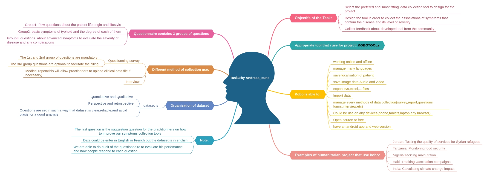

<h2>Design a Data collection tool to record symptoms Data</h2>

The principal aim of this task is to develop a data collection tool addressed to local healthcare,professional and practionners which permit to collect and examine symptoms of Typhoid and to establish the diagnosis by specifying the  degree of severity of the disease. 

The picture below present the feedback of my contribution

To view the questionnaire form designed go to [This page](https://ee.humanitarianresponse.info/x/BPctGlyz).

 Know more about [KoboTools](https://www.kobotoolbox.org/)
 
The form is ready to collect symptoms.Thank you!

Contributor: **Andreas_sune**
<andreas007sune@gmail.com>

