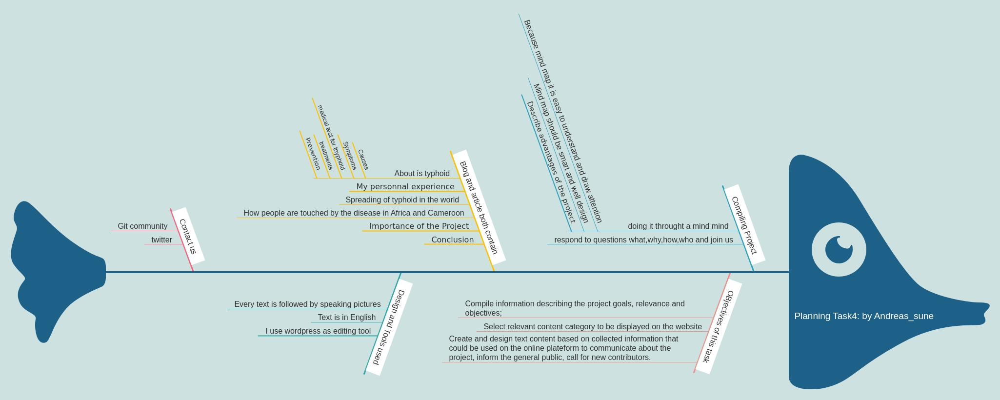

<h2>Create content for the project's online platform</h2>

The objective of this task is to compile relevant infomation about the project and create content that will be share through the project's online platform. Content include blog notes, articles, project description and any other relevant document deemed useful by the applicant. 

I have planned this activities through a mind map below

 The result is available [Here](https://mbifot.art.blog)
 
Thank You!

Contributor: **Andreas_sune**
<andreas007sune@gmail.com>

