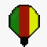

# Task: "Design a logo for the project"

Although I have no design experience, I created a logo as an example that can be restructured by someone with more experience in illustration. Creating the logo as a light bulb comes from its symbolism that represents ideas and innovation. It fits the project's objective that aims to improve the quality of life through open science, which allows innovations. In addition, the lamp is colored with the colors of the Cameroon flag.

