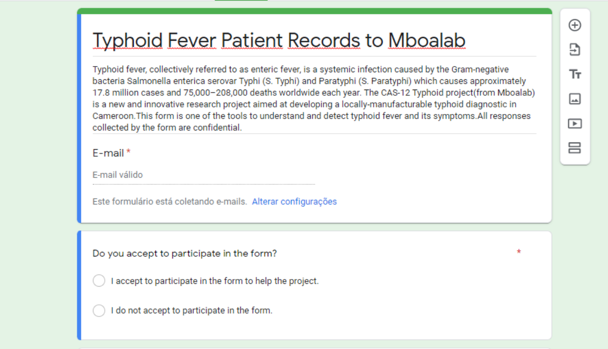
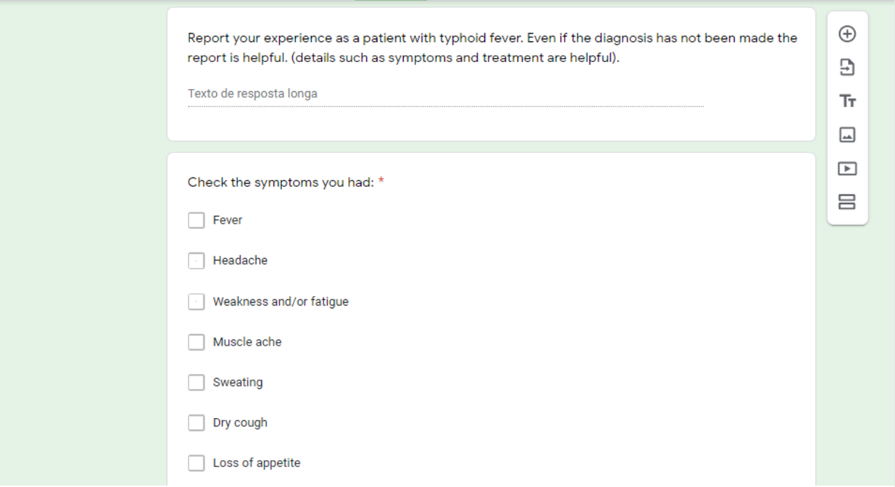
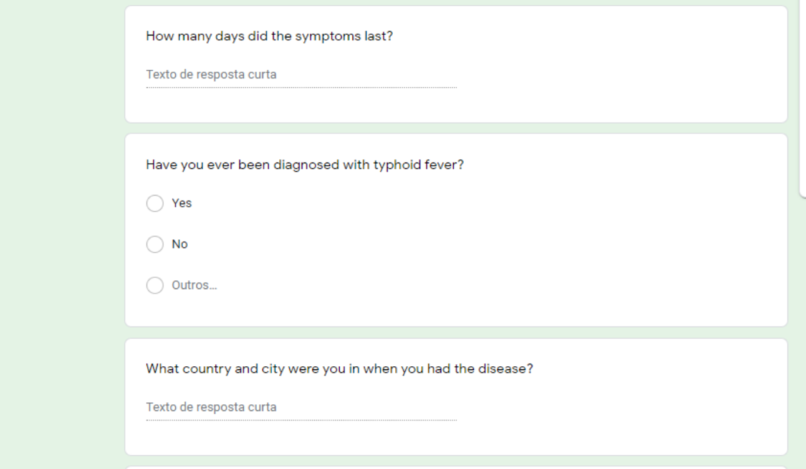
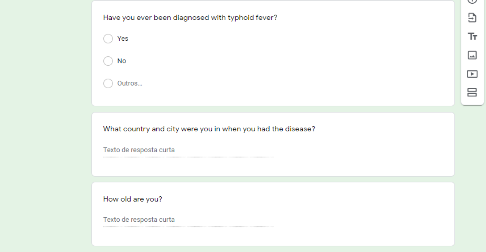
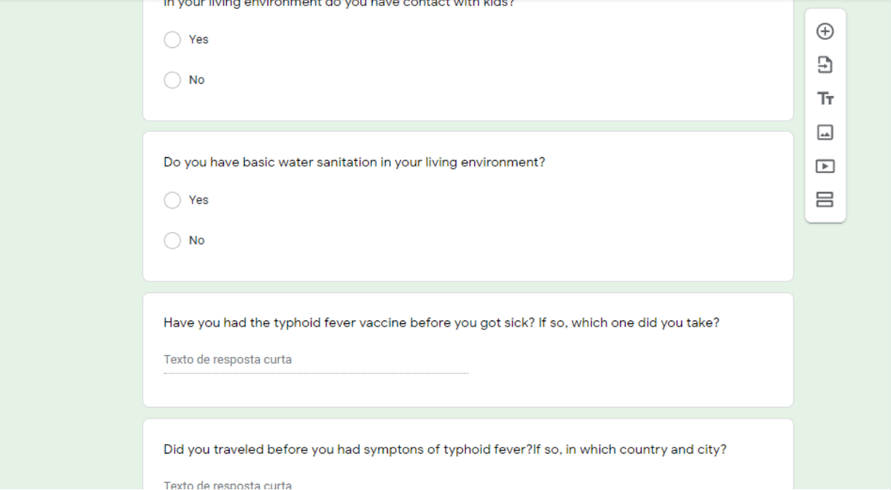
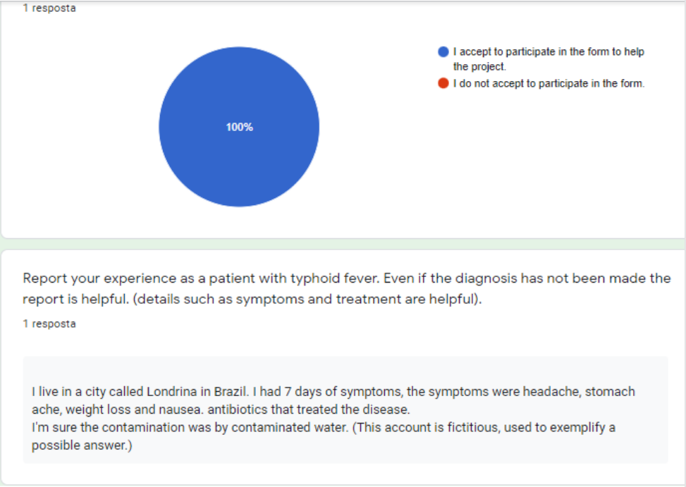
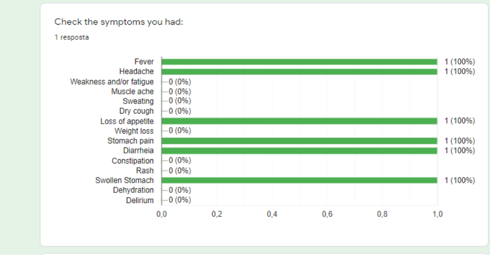
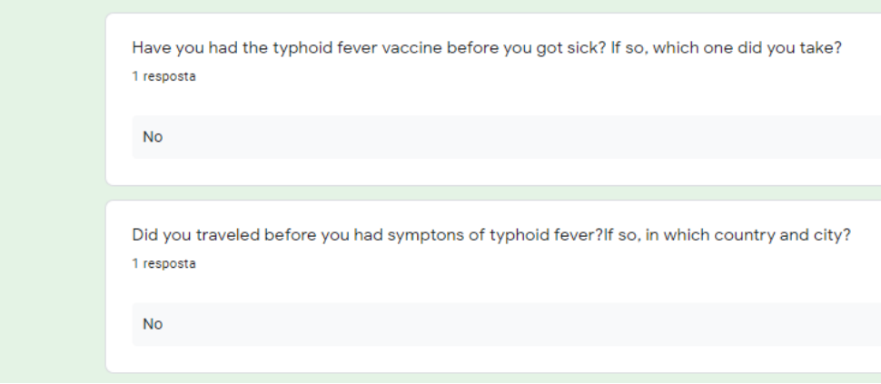
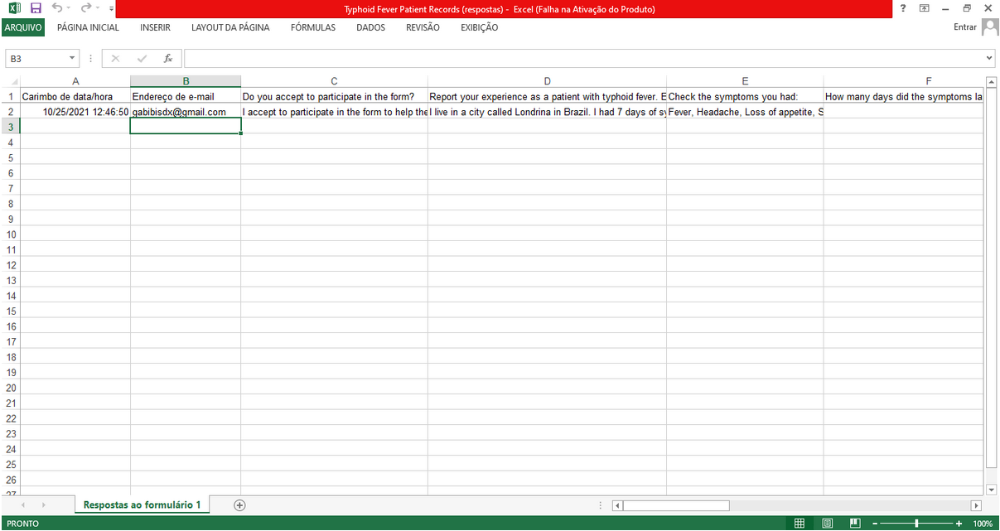

# Task: "Design a data collection tool to record symptom data."

## Data Collection Tool  
After researching through the topic of Data Collection, I think that forms and interviews with questionnaires could work for this project. I have reached this conclusion after searching with the keywords "data collection" AND "fever" AND "typhoid fever" in Google Scholar, resulting in academic papers as [^1].  
Google Forms is very useful because it allows the creation of forms in several languages. It does not restrict the number of forms created and submitted to be answered.   

The ease of use of the tool is something that can be seen in the example form I have made, taking into account some symptoms of typhoid fever:   https://docs.google.com/forms/d/e/1FAIpQLSe5dPPEz-ZtF6qXVROdzMRFgD9qN1g6MPsAUz8I00AklrQViw/viewform?usp=sf_link

[The form and other examples can also be found at the bottom of this document.](#form-example)

The unique limitation of the tool is that it is not offline. As a solution to that, face-to-face and telephone interviews would be conducted. Using the phone as a channel for collaborators to collect data is less expensive and labor-intensive than requiring the participant or interviewers to travel. In addition, the telephone allows interviewers to collect data from people in a larger geographic area.  
Another benefit of interviews through the phone is that the interviewer can readily schedule a second call if the participant is unwell or busy at that time.  
Face-to-face interviews are helpful in cases of lack of access to telephone and internet. In addition, direct contact between the researcher and the interviewer can facilitate understanding the information transmitted.

## Interview Method  
The interview method that best fits the objective is semi-structured. Health professionals widely use this practice to allow the interview to be conducted with a focus on issues that should be explored[^1].  
Furthermore, before the prepared questions are asked, the interviewee is asked to report through the form or interview about their experience of having/had typhoid fever. That allows data analysis to be quantitative and qualitative, focusing on details and sequential events described by the interviewee. The questions to be asked in person and by phone will be the same ones available in the google form, which will also be used for data collection. This way, after the interview, the interviewer can manually record the interviewee's answers in the google form.  
Before an interview takes place, interviewees should be informed about the project's purpose and be assured of ethical principles such as confidentiality and data security.  Setting up interviewees' expectations for the interview increases the likelihood of honesty and is also an essential aspect of consent.  

## Data Storage and Analysis
Some suggestions for storage with a focus on analyzing the data later are Excel, Relational database, Data warehouse.  
The project's researchers can easily convert the data in google forms to an Excel spreadsheet, which allows you to store and generate graphics of the data [^2]. However, it can be difficult to query and analyze a large amount of data in a spreadsheet. As an alternative, it is possible to create a relational database to store the data, allowing greater control and searching capabilities.  
Creating a Data Warehouse would be helpful to the project as its intended use is for advanced queries and analysis to be done over data. Data warehouses also often contain large amounts of historical data.  
According to Oracle in [^3]: 
>“The data in a data warehouse is typically derived from a wide variety of sources, such as application log files and transaction applications. A data warehouse centralizes and consolidates large amounts of data from multiple sources. Its analytics capabilities enable organizations to get useful business insights from their data to improve decision-making. Over time, a historical record is created that can be critical for data scientists and business analysts. Because of these features, a data warehouse can be considered the organization's “only true source”.  

[^1]: "Qualitative methods in research on healthcare quality
" http://dx.doi.org/10.1136/qhc.11.2.148
[^2]: "Export spreadsheets" https://support.google.com/docs/answer/9330963?hl=en&ref_topic=9296611#7.2
[^3]: "What Is a Data Warehouse?" https://www.oracle.com/database/what-is-a-data-warehouse/

## [Form Example](https://docs.google.com/forms/d/e/1FAIpQLSe5dPPEz-ZtF6qXVROdzMRFgD9qN1g6MPsAUz8I00AklrQViw/viewform?usp=sf_link)

### Google Forms for Data Collection (Questions):

### Google Forms for Data Collection (Answers and Charts):

### Data Collection results from Google Forms in Excel:

