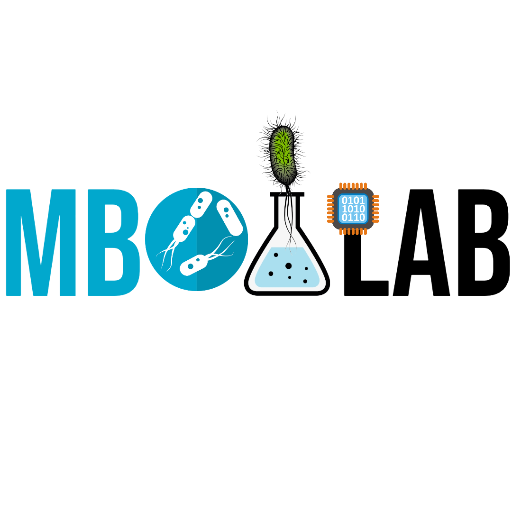
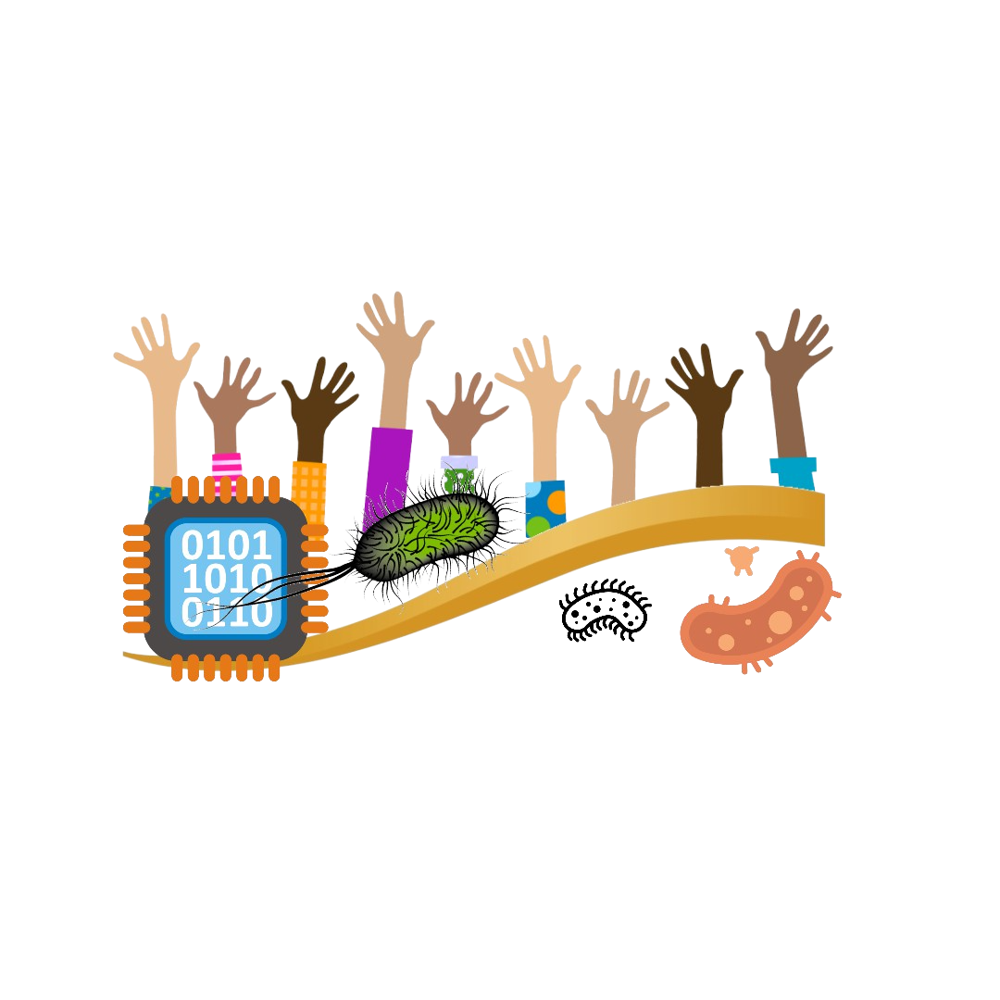

### Author | Lawrence Elango  | Task 1: Design a Logo for the project

### MBOALAB OUTREACHY PROJECT LOGO DESCRIPTION

#### Context

**MboaLab is an open collaborative space for data science which pushes for sustainable development and the growth of healthy communities. To do this, they carryout lots of research in this space and push the boundaries to ensure that these goals amongst others are met. The project the logo is for is titled "Improve diagnostics of typhoid through Open Science: An Artificial Intelligence-based technique".**

#### Idea

  With the project aiming at diagnosing typhoid in a better way using open science and Artificial intelligence, the logo was put together with this in mind. The logo is made up of the following parts or segments

  1. 8 hands of different colors raised up : This is to depict diversity and the fact that typhoid can be gotten by everyone no matter their race.

  2. Salmonella bacteria : A salmonella bacteria is shown to touch some of the hands, which depicts someone getting infected by the virus.

  3. A CPU Chip: This is to show that with Artificial intelligence, symptoms can be addressed way before hand in order to prevent the virus from spreading further and causing more damage.

  4. A curved line: The line separates the the appearance of a good health state from that of the virus. Above it are the hands which are always trying to do their best to live healthy lives, while below are the viruses which are always ready to attack at all times. The smaller baterium shows that it always starts at an infancy stage, and grows to a bigger monster.

### Sample

Square Logo (1080 X 1080):

Transparent Logo:

## Conclusion

The logo was designed and to demonstrate how it looks in practice, it was used with the online platform which can be accessed here [Online platform using logo](https://choclawrence.github.io/mboalab/)

---
## MENTOR

**Mr Stephane Fadanka**

___