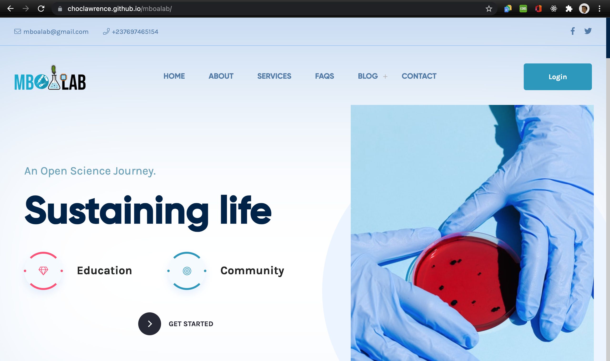
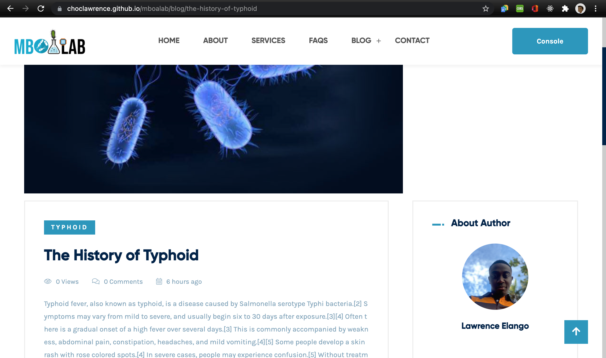
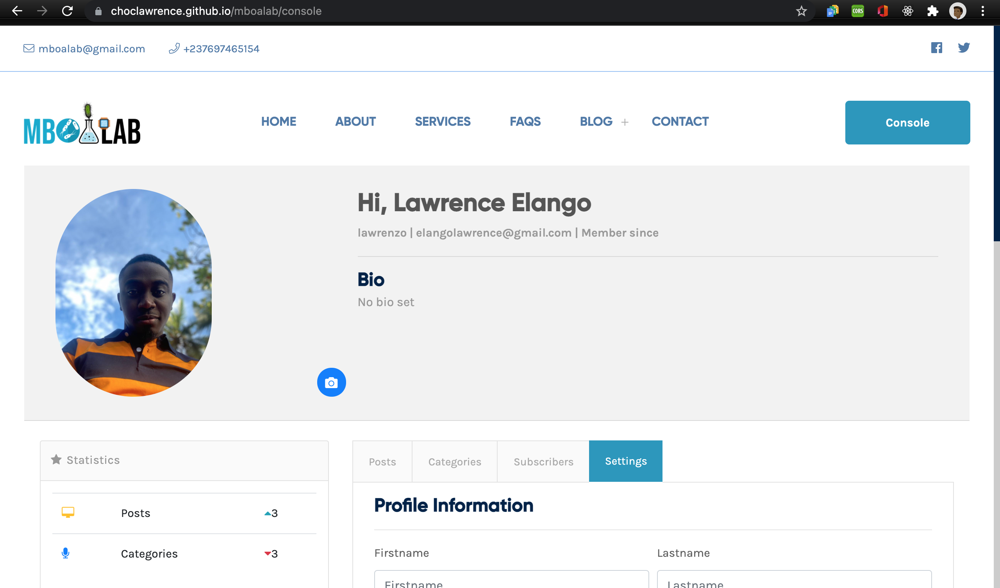
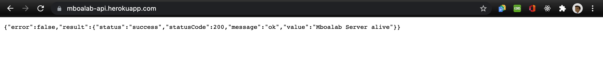

### Author | Lawrence Elango | Task 2: Build an Online Platform for the project

### MBOALAB ONLINE PLATFORM

### FRONTEND | ANGULAR

The [online platform](https://choclawrence.github.io/mboalab/ "Mboalab Online Platform") is built with Angular which is a well known SPA framework.It is hosted with [Github pages](https://pages.github.com/).

It was made carefully to be able to harness all the possibilities which Mboalab aims to promote. It is maintainable and compartmentalized.The features for users include the following

---

1. Registration
2. Login
3. Password reset
4. Create blog post
5. Edit blog post
6. Delete blog post
7. Edit profile data
8. Subscribe to newsletter

---

Extra features belonging only to the admin are

---

1. Create categories
2. Update categories
3. Delete categories
4. Delete subscribers

More features will be added and current ones updated.

### BACKEND | NODE JS

The [backend](https://mboalab-api.herokuapp.com/ "Mboalab API") of this platform was made possible with Node js which is an open source server side scripting language. It helps in the building of scalable server applications with javascript. The API was hsoted on [Heroku](https://www.heroku.com/)

### DATABASE | MONGO DB

The database used for the Mboalab project is MongoDB. It is a source-available cross-platform document-oriented database program. Classified as a NoSQL database program, MongoDB uses JSON-like documents with optional schemas. MongoDB is developed by MongoDB Inc. and licensed under the Server Side Public License (SSPL).
[Mongo DB - Wikipedia](https://en.wikipedia.org/wiki/MongoDB)

# USEFUL LINKS

The Mboalab official website can be found [here](https://www.mboalab.africa/ "MboaLab Website")

The online platforms website can be found [here](https://choclawrence.github.io/mboalab/ "Mboalab Online Platform")

The API for the online platform can be found [here](https://mboalab-api.herokuapp.com/ "Mboalab API")

# SCREENSHOTS

---

1. Homepage:
   

2. Signup page:
   

3. Login page:
   

4. Blog details:
   

5. Profile:
   

6. API Health Check:
   

---
## MENTOR

**MR. Elisee Jafsia**

___

## SETUP FOR DEVELOPERS

# GETTING STARTED

This project was generated with [Angular CLI](https://github.com/angular/angular-cli) version 11.2.1.

## Development server

Run `ng serve` for a dev server. Navigate to `http://localhost:4200/`. The app will automatically reload if you change any of the source files.

## Code scaffolding

Run `ng generate component component-name` to generate a new component. You can also use `ng generate directive|pipe|service|class|guard|interface|enum|module`.

## Build

Run `ng build` to build the project. The build artifacts will be stored in the `dist/` directory. Use the `--prod` flag for a production build.

## Running unit tests

Run `ng test` to execute the unit tests via [Karma](https://karma-runner.github.io).

## Running end-to-end tests

Run `ng e2e` to execute the end-to-end tests via [Protractor](http://www.protractortest.org/).

## Further help

To get more help on the Angular CLI use `ng help` or go check out the [Angular CLI Overview and Command Reference](https://angular.io/cli) page.

---