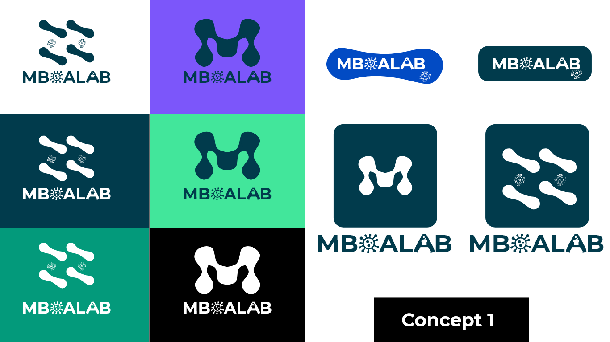
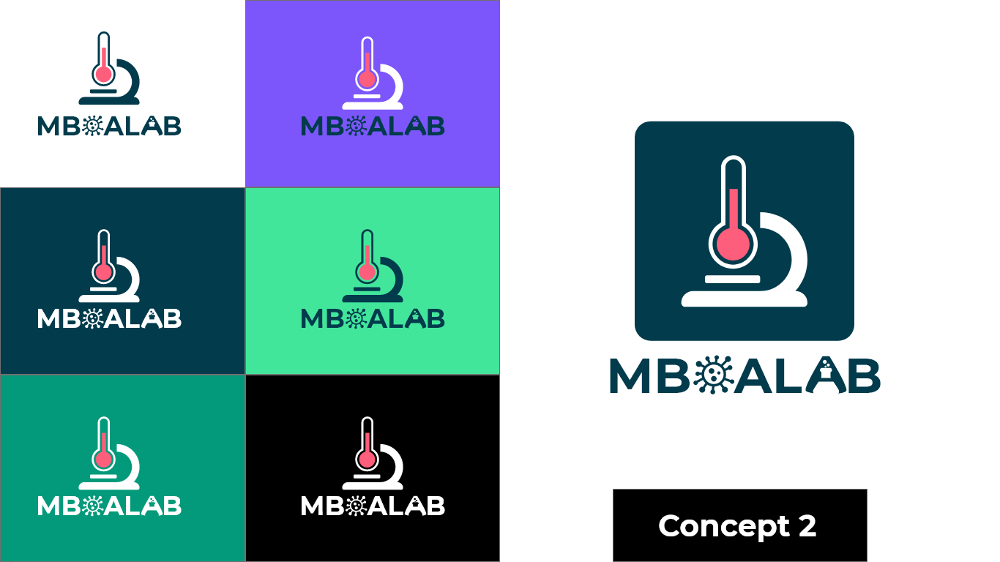
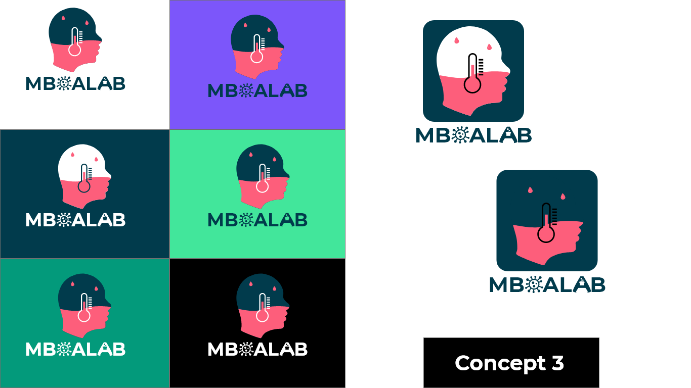
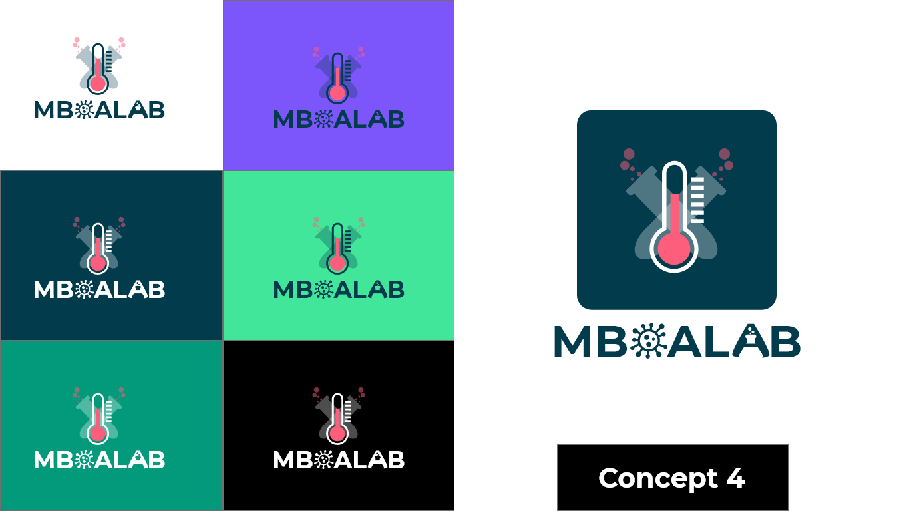
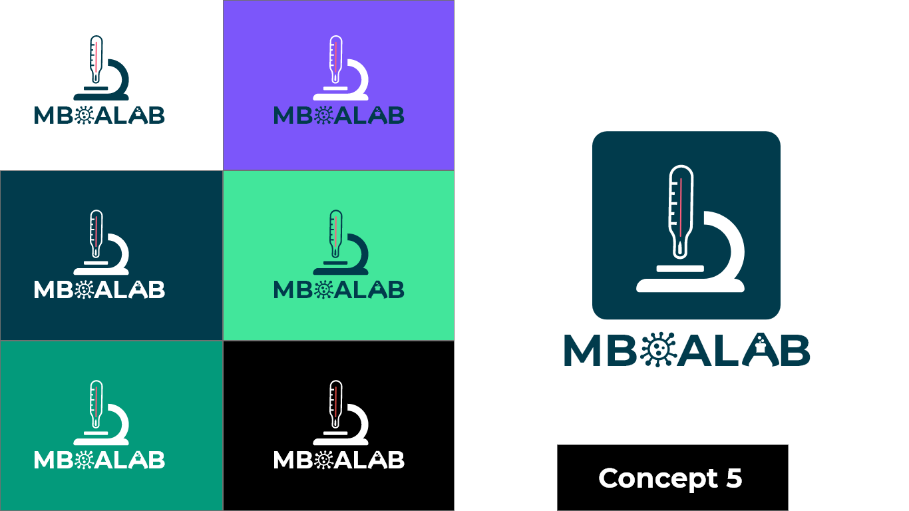

# Task 1 Logo Design by MELI TCHOUALA IMELDA

### [Main Logo Text](main-text.svg)

## Concept 1

-> [Logo v1](logo-concept-1-v1.svg) The bacteria shaped O represents the bacteria which causes Typhoid Fever, Moreover, the AI shaped bacteria represents the 
technology used for research and the main mboalab styled text to represent the Lab.

-> [Logo v2](logo-concept-1-v2.svg) Has an M styled mark for MboaLab the colors can always be changed.

## Concept 2

-> [Logo v1](logo-concept-2.svg) The Microscope here is used to represent research in MboaLab and the Thermometer to represent the health aspect of Typhoid.

## Concept 3

-> [Logo v1](logo-concept-3-v1.svg) The red on the head shaped logo represents someone who has fever, the testtube represents the research for a possible cure and the head stands to 
represent a person.

-> [Logo v2](logo-concept-3-v2.svg) Same as the above logo but without the top section.

## Concept 4

-> [Logo v1](logo-concept-4.svg) Here the test tubes show the active research being carried out at MboaLab and the Thermometer shows the Typhoid aspect.

## Concept 5

-> [Logo v1](logo-concept-5.svg)  The Microscope here is used to represent research in MboaLab and the Thermometer to represent the health aspect of Typhoid.

These are my proposals waiting for feedbacks to update them as required.
