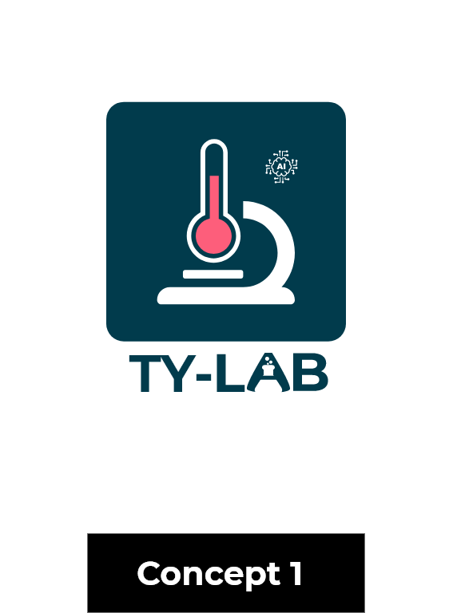
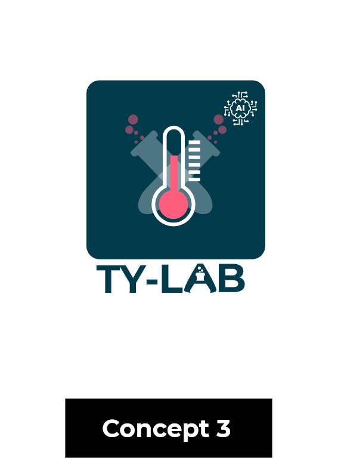
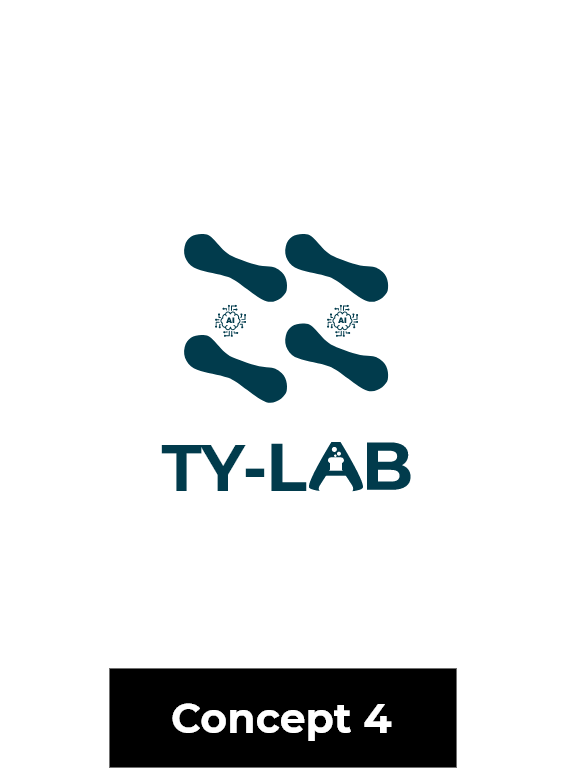

# Task 1 Logo Design by MELI TCHOUALA IMELDA

## Concept 1
Ty-Lab is a symbolic name chosen for the project. It expresses a Typhoid Laboratory where solutions
for typhoid ever are developed using AI technologies and this is equally shown by the AI shaped bacteria.

## Concept 2
 Ty-Lab is a symbolic name chosen for the project. It expresses a Typhoid Laboratory where solutions
for typhoid ever are developed using AI technologies and this is equally shown by the AI shaped bacteria.

## Concept 3
 Ty-Lab is a symbolic name chosen for the project. It expresses a Typhoid Laboratory where solutions
for typhoid ever are developed using AI technologies and this is equally shown by the AI shaped bacteria.

## Concept 4
 Ty-Lab is a symbolic name chosen for the project. It expresses a Typhoid Laboratory where solutions
for typhoid ever are developed using AI technologies and this is equally shown by the AI shaped bacteria.
